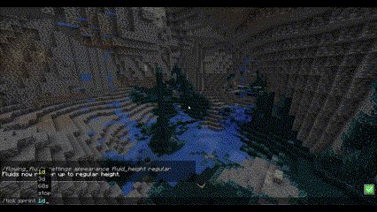
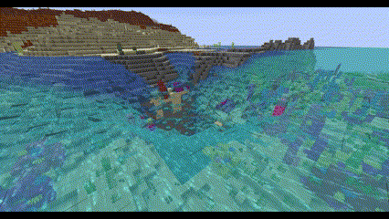
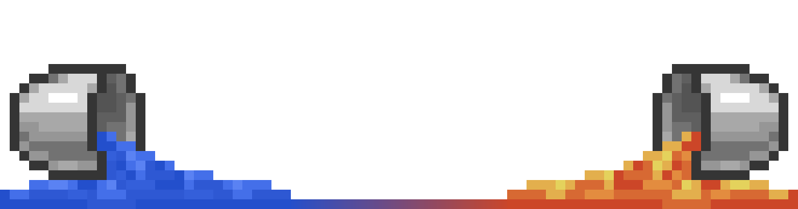

---

---

# About

Flowing fluids is a mod adding more realistic fluid physics to the game, making fluids mostly finite, and adding an 
element of fluid management to the game. With dozens of settings for performance, flowing behaviour, gameplay elements, and visuals

It is a spiritual successor to some of the various other abandoned water physics mods over the years, but built from scratch for modern
Minecraft. 

Implemented in a way that is compatible with *(most)* mod added fluids, and that allows you to 
disable/remove the mod at any time to return to vanilla mechanics with any 'not currently flowing' fluids remaining fully intact for vanilla purposes.

## ⚠️ The mod is currently in early development ⚠️
It is not yet feature complete, and I make no promises of release quality stability at this stage, and there may yet be 
some unknown breaking bugs and further room for performance improvements.

---

# Features

Many of these can be tweaked or even disabled via the `/flowing_fluids settings` command, use `/flowing_fluids help` if you are confused.

### **Flowing Fluids**:

Fluids will flow and spread outwards and down inclines, filling up spaces and creating pools.

This can be tweaked in various ways, such as how far they flow, and how aggressively the fluid tries to level itself in pools.

This means you can create things like aqueducts.

or flood areas with water.

or lava.

or even modded fluids.

### **Finite Fluids**:

Fluids are finite, and will flow until they run out, or are blocked.

This means you will need to manage your water supply, and can't just place a single water source block and have infinite water.

Oceans, Rivers, and Swamps however, will act as infinite water sources, but there is a limit to how fast they will refill,
and they can still be drained *(Controlled in settings)*.

### **Pumping**:

Fluids can be moved by pistons to pump them upwards automatically.

