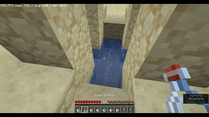
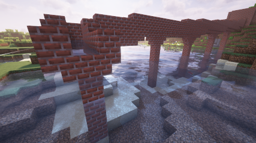
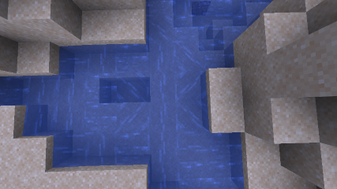
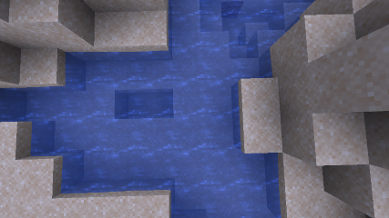
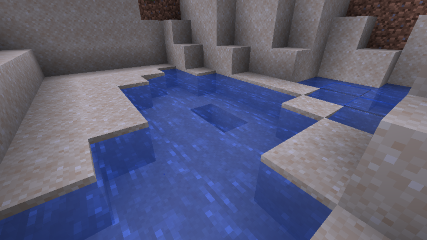
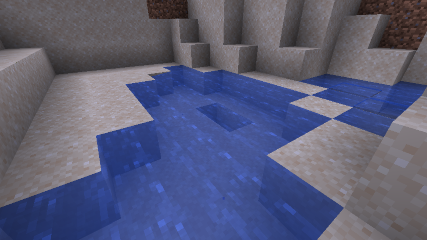
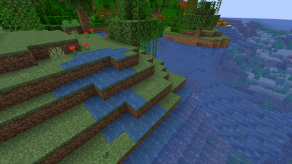
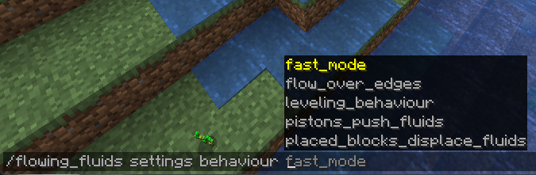

---

---

# About

Flowing fluids is a mod adding more realistic fluid physics to the game, making fluids mostly finite, and adding an 
element of fluid management to the game. With dozens of settings for performance, flowing behaviour, gameplay elements, and visuals

It is a spiritual successor to some of the various other abandoned water physics mods over the years, but built from scratch for modern
Minecraft. 

Implemented in a way that is compatible with *(most)* mod added fluids, and that allows you to 
disable/remove the mod at any time to return to vanilla mechanics with any 'not currently flowing' fluids remaining fully intact for vanilla purposes.

## Server side or Client side?

This mod works best when on both `server` and `client` side. However, it is only **required** on the `server` side, if 
you don't want the visual features and don't mind some minor client-side de-sync when directly interacting with fluids, such as using buckets.

There is no harm in joining a vanilla server with this mod enabled, however you will get the same minor client-side de-sync
as you would when joining a server with the mod without it on the client.

## ⚠️ The mod is currently in early development ⚠️
It is not yet feature complete, and I make no promises of stability at this stage, as there may yet be 
some unknown breaking bugs and further room for performance improvements.

---

# Features

Many of these can be tweaked or even disabled via the `/flowing_fluids settings` command, use `/flowing_fluids help` if you are confused.

## **Flowing Fluids**:

Fluids will flow and spread outwards and down inclines, filling up spaces and creating pools.

This can be tweaked in various ways, such as how far they flow, and how aggressively the fluid tries to level itself in pools.

This means you can create things like aqueducts.

or flood areas with water.

or lava.

or even modded fluids.

## **Finite Fluids**:

Fluids are finite, and will flow until they run out, or are blocked.

This means you will need to manage your water supply, and can't just place 2 water source blocks and have infinite water.

Oceans, Rivers, and Swamps however, will act as infinite water sources, but there is a limit to how fast they will refill,
and they can still be drained *(Controlled in settings)*.

Fluids will also be displaced by blocks wherever possible to avoid losing any fluid.

## **Piston Pumps**:

Fluids can be moved by pistons to pump them upwards automatically.

## **Gameplay Elements**:

There are a few new gameplay elements that will drain or use water, to encourage water management.

Such as farmlands draining a water level whenever it hydrates.

Bottles will consume 2-3 water levels when filled.

Buckets are able to pick up 1 - 8 levels of fluid, and can be used to place down precise amounts.

With fluids being displaced by block placement, you will need to find other ways to drain it away, such as using sponges, creating drains, 
or tweaking the evaporation settings mentioned below.

There are also various ways in which water specifically naturally evaporates or refills *(Rates customizable via settings)*

- Small *(level 1)* water puddles will evaporate slowly in the over world.
- Any water will evaporate quickly in the nether.
- Any water blocks that are not full *(levels 1-7)* will refill over time when exposed to rain.
- Any water blocks that are not full *(levels 1-7)* will refill over time when in Ocean, River, or Swamp biomes, below sea level, and exposed to skylight.'

## **Mod and Vanilla backwards compatibility**:

Any mod added fluids should work with the mod, though if the modded fluid has special properties, they may not be fully supported.

I plan to add support for blacklisting modded fluids in the future, and prefill the list with known breaking fluids.

This mod can also be disabled (`/flowing_fluids settings enable_mod on|off`) or removed at any time without breaking the world, as any fluid that is 'full' *(8 levels)* will be saved as a vanilla source block. 
And all 'non-full' fluids *(1-7 levels)* will be saved as a vanilla flowing blocks which will just disappear once updated in vanilla.

## **Visuals**:

The mod renders fluids completely normally, using the regular vanilla fluid rendering, this allows it to be compatible with shaders.

The mod allows hiding the flowing texture that normally appears on fluids when there is a height difference. *(enabled by default)*

`/flowing_fluids settings appearance flowing_texture`

The mod also allows changing the heights at which 'full' fluids render.

`/flowing_fluids settings appearance fluid_height`

You can also prevent minimum level fluids from flowing over edges, if you prefer that visual.

`/flowing_fluids settings behaviour flow_over_edges`

## **Performance**:

The mod is designed to be as performant as possible. However, massive amounts of flow affecting hundreds or thousands of blocks,
such as quickly draining an ocean, is going to cause some unavoidable server side lag. As much as any other thing affecting this many blocks would.

The primary performance setting available to you right now is `/flowing_fluids settings fast_mode`. 

Fast mode uses a much simpler and faster fluid flowing algorithm, limiting fluids to only spread to their direct neighbours, instead of seeking out the nearest ledge within 4 blocks.

# Planned features

- fluid pressure system to affect flow rate *(if it can be performant)*
- setting to blacklist specific fluids
- further settings for as many minute variables that affect performance as makes sense to add
- further gameplay elements to encourage water management, such as the farmlands draining water
- maybe backport to 1.20.1 *(and no further)*
- settings for interaction with the `Create` mod once it's on 1.21, to affect pipe and water wheel behaviours *(it should already partially work anyway, but may need balancing)*

